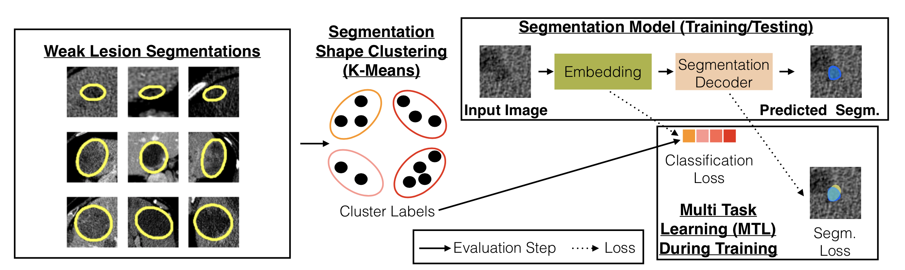
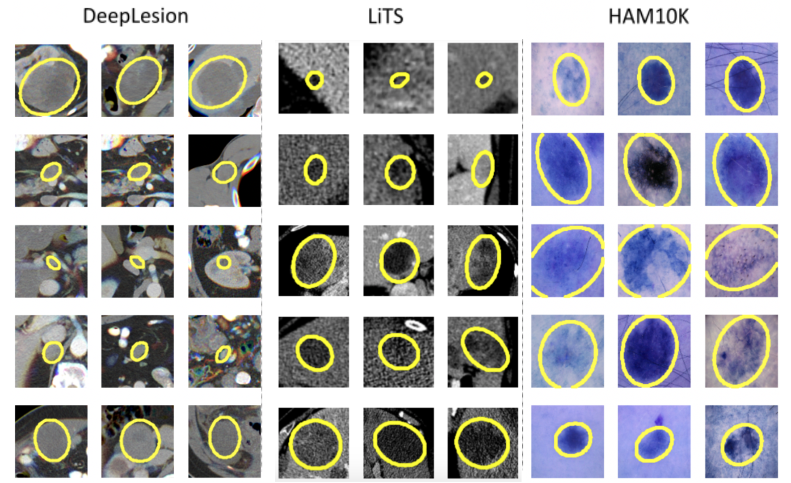
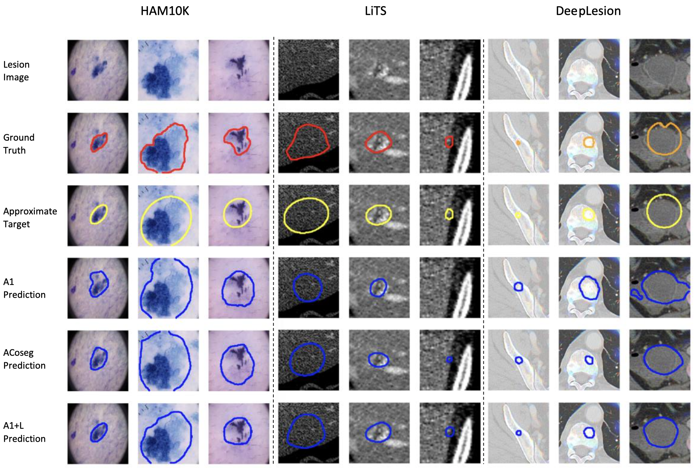

# Improving Weakly Supervised Lesion Segmentation using Multi-Task Learning

## Introduction
This is a code release of the paper "Weakly Supervised Lesion Segmentation using Multi-Task Learning". 

We introduce the concept of multi-task learning to weakly-supervised lesion segmentation, one of the most critical and challenging tasks in medical imaging. Due to the lesions' heterogeneous nature, it is difficult for machine learning models to capture the corresponding variability. We propose to jointly train a lesion segmentation model and a lesion classifier in a multi-task learning fashion, where the supervision of the latter is obtained by clustering the RECIST measurements of the lesions.

### License
This work is released under the GNU General Public License (GNU GPL) license.

## Requirements
----
1. python3.8 was tested
2. pytorch 1.7.1 version was tested 
3. Please refer to the requirements.txt file for other dependencies.

## Installation
1. pip install -r requirements.txt
2. git clone https://github.com/qubvel/segmentation_models.pytorch.git

## HAM10K Dataset
Download and unzip to the folder code_ham/Data_ham:

1. Raw images: https://dataverse.harvard.edu/dataset.xhtml?persistentId=doi:10.7910/DVN/DBW86T
2. Ground true segmentations: https://www.kaggle.com/tschandl/ham10000-lesion-segmentations?select=HAM10000_segmentations_lesion_tschandl

## Trained checkpoints for HAM10K
Put under the folder code_ham/checkpoints to evaluate:  

1. A1: https://drive.google.com/file/d/12gK0K_SZNleFAFVwPjzspHIS3rsWGXEb/view?usp=sharing
2. A1+L: https://drive.google.com/file/d/1yFIfjXay9TRw_Wn_QLbfAdhMpFhcAqdC/view?usp=sharing
3. ACoseg: https://drive.google.com/file/d/1B-3bG26yqpnupkH-q-qNHp1_IrU4EQf4/view?usp=sharing

## Instructions
1. Run code_ham/HAM_data.ipynb for data preprocessing.
2. Run code_ham/HAM_A1_A1class.ipynb for A1 and A1+L model in the paper.
3. Run code_ham/HAM_ACoseg.ipynb for ACoseg model in the paper.

## Results
----
Cluster visualizations can be seen below. Clustering based on RECIST parameters allows grouping lesions into groups with similar shapes.

Visualization of sample segmentation results. 1st row - input lesion image. 2nd row - ground truth. 3rd row - appeoximate target. 4th row - result of A1 baseline, based on DeepLabV3+ (A1). 5th row - result of co-segmentation baseline (ACoseg), [Agarwal, 2020a]. 6th row - our result (A1+L). 

